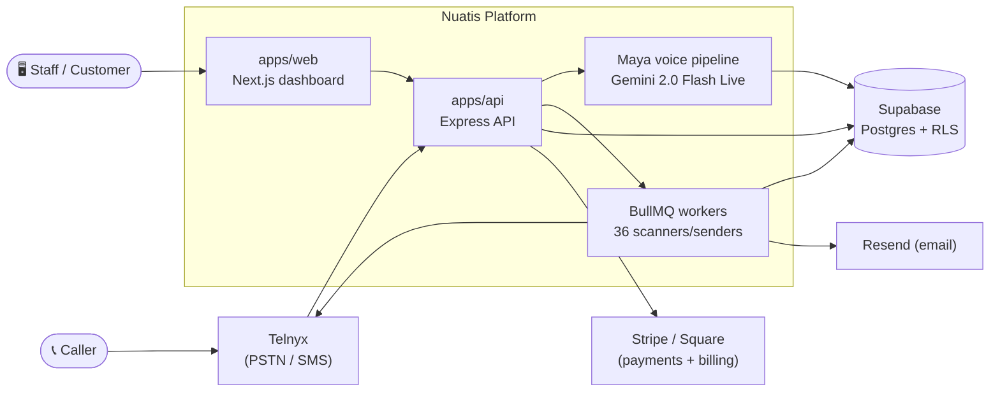

# Nuatis

[](https://github.com/siddhu6064/Nuatis/actions/workflows/ci.yml)


**AI-powered front-office SaaS for SMBs.** Maya answers your phones, books appointments, sends follow-ups, and closes deals — so your team doesn't have to.

---

## What is Nuatis?

Nuatis is a vertical-aware CRM + Voice AI platform for small and mid-sized businesses. One subscription replaces the receptionist, the scheduling software, the follow-up automation, and the CRM.

A call comes in → **Maya** answers in under 1.5 seconds, in whichever of 4 languages the caller speaks → checks the calendar live → books the appointment → logs the contact and activity in the CRM → the automation layer takes it from there (reminders, no-show recovery, review requests) with zero human touch, unless one is needed — Maya escalates those.

**16 verticals**, one codebase, config-first: dental · medical · veterinary · salon · spa · gym · nail bar · pet grooming · tattoo · car wash · laundry · restaurant · contractor · law firm · real estate · sales CRM

---

## Architecture



Everything ships from one monorepo. `apps/api` and its 36 BullMQ workers own the voice pipeline, the CRM/ops routes, and every scheduled scanner (no-show recovery, invoice-overdue, low-stock alerts, and so on). `apps/web` is a thin Next.js client over that API — no business logic duplicated on the frontend.

---

## What's inside

| Area                        | Modules                                                                                                                                                                 |
| --------------------------- | ----------------------------------------------------------------------------------------------------------------------------------------------------------------------- |
| **Voice + CRM (always on)** | Maya (Voice AI receptionist, cross-call caller memory) · CRM (contacts, companies, deals, custom fields, lead scoring)                                                  |
| **Core tier**               | Scheduling (native + Google/Microsoft 365, self-service reschedule/cancel) · Pipeline (Kanban, forecasting, quotas)                                                     |
| **Pro tier**                | Automation (36 BullMQ scanners) · Insights (analytics, cohort retention, trial funnel) · AI Campaigns (SMS/email/social, A/B tested) · Orders · Expenses · Staff Portal |
| **Scale tier**              | CPQ (quotes, promo codes, payment links, refunds) · SSO (WorkOS, SAML/OIDC)                                                                                             |

Also included: vendors/purchase orders, inventory (variants, kits, barcode, multi-location), a customer self-service portal, Stripe Connect, and an outbound-webhooks + API-key layer for integrating with the outside world.

---

## Tech Stack

| Layer     | Technology                                                             |
| --------- | ---------------------------------------------------------------------- |
| Frontend  | Next.js 14 App Router · Tailwind v3 · Recharts · @hello-pangea/dnd     |
| API       | Express · TypeScript (ESM, NodeNext) · BullMQ                          |
| Mobile    | React Native + Expo (iOS/Android)                                      |
| Voice AI  | Gemini 2.0 Flash Live — STT + LLM + TTS unified, ~$0.008/call          |
| Telephony | Telnyx — PSTN, SIP, SMS, 10DLC approved                                |
| Database  | Supabase Postgres + RLS, 194+ migrations                               |
| Auth      | Auth.js v5 (credentials) · SSO via WorkOS (SAML/OIDC)                  |
| Queue     | BullMQ + Azure Cache for Redis                                         |
| Email     | Resend (transactional)                                                 |
| Calendar  | Native (default) · Google Calendar · Microsoft 365                     |
| Payments  | Stripe (billing, Connect, refunds) · Square (per-tenant OAuth)         |
| Deploy    | Azure Container Apps (API) · Next.js standalone (Web)                  |
| CI/CD     | GitHub Actions · Node 24 · 1,626 API tests / 211 suites · 16 web tests |

---

## Repository Structure

```
apps/
  web/          Next.js 14 dashboard
  api/          Express API + voice pipeline + BullMQ workers
  mobile/       React Native + Expo
packages/
  shared/       Shared types, VERTICALS config, utilities
infra/
  azure/        Container Apps deployment scripts
supabase/
  migrations/   194+ migration files (sequential, 0001–0194)
```

---

## Getting Started

```bash
git clone https://github.com/siddhu6064/Nuatis.git
cd Nuatis
npm install

cp apps/api/.env.example apps/api/.env
cp apps/web/.env.example apps/web/.env.local
# fill in required values — see Environment Variables below

npx supabase db push

npm run dev   # web :3000 · api :3001
```

**Mobile:**

```bash
cd apps/mobile && npx expo start
```

**Tests:**

```bash
cd apps/api && NODE_OPTIONS=--experimental-vm-modules npx jest   # 1,626 tests · 211 suites
cd apps/web && npx jest                                          # 16 tests · 3 suites
```

---

## Production Infrastructure

| Resource               | Value                            |
| ---------------------- | -------------------------------- |
| Web                    | https://app.nuatis.com           |
| API                    | https://api.nuatis.com           |
| Health                 | https://api.nuatis.com/health    |
| Azure region           | South Central US                 |
| Redis                  | Azure Cache for Redis (Basic C1) |
| Container registry     | nuatisacr.azurecr.io             |
| Supabase project       | zhykavqqvvvpfpgtipzp.supabase.co |
| 10DLC Brand            | B2FT83B (approved)               |
| Maya production number | +1 512 737 6388                  |
| Maya demo number       | +1 512 737 6322                  |

---

## Environment Variables

Full list in `apps/api/.env.example`. Required to run locally:

```
SUPABASE_URL
SUPABASE_SERVICE_ROLE_KEY
GEMINI_API_KEY
TELNYX_API_KEY
TELNYX_TENANT_MAP
REDIS_URL
AUTH_SECRET
RESEND_API_KEY
STRIPE_SECRET_KEY
VAPID_PUBLIC_KEY
VAPID_PRIVATE_KEY
CORS_ORIGIN
SCANNERS_ENABLED
```

---

## Compliance

| Vertical                                                                                   | Compliance                                            |
| ------------------------------------------------------------------------------------------ | ----------------------------------------------------- |
| dental, medical                                                                            | HIPAA · BAA required · 6-yr retention · Practice plan |
| law_firm                                                                                   | ABA 1.6/1.1 attorney-client privilege                 |
| real_estate                                                                                | FHA · TREC                                            |
| veterinary                                                                                 | TX ITEA                                               |
| salon, restaurant, contractor, spa, gym, nail_bar, tattoo, car_wash, laundry, pet_grooming | TCPA · opt-in gated · STOP language · 10DLC approved  |
| physical_therapy, optometry                                                                | HIPAA-gated — deferred until HIPAA hardening complete |

---

## Deployment

```bash
cd infra/azure && ./deploy.sh      # build + push containers
./update-env.sh                    # sync env vars to Azure
```

Both containers run on Azure Container Apps, South Central US. Budget alert at $700/mo → sid@nuatis.com.

---

**Call Maya:** +1 512 737 6322 — say "book an appointment" or "get a quote."

---

## Built by

[Sid Yennamaneni](https://github.com/siddhu6064) — founder, Nuatis LLC
